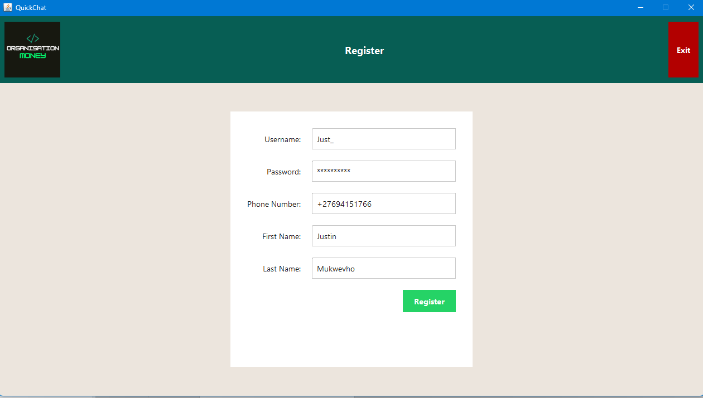
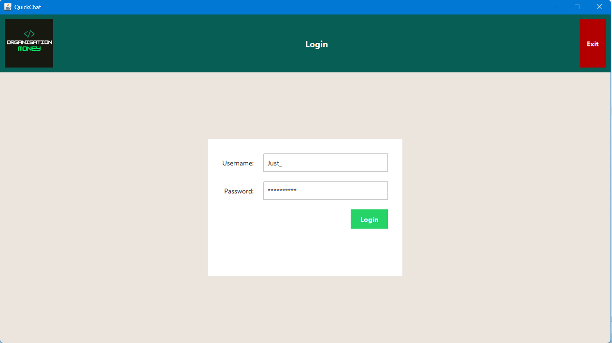

# ST10101766-PROG5121-POE
U. Justin Mukwevho : ST10101766

A simple WhatsApp-inspired chat application called QuickChat.

## Features
- User registration with validation (username, password, phone, name).
- Login system with feedback.
- WhatsApp-like UI with teal header, green buttons, and light gray background.
- Fixed HD GUI window.
- Future Messaging feature with read receipts 

## Screenshots
*Registration Screen*  


*Login Screen*  


*Messages Screen*  


## Prerequisites
- **JDK 21**: Ensure Java 21 is installed.
- **Maven**: For dependency management and building.
- **NetBeans 19**: Optional IDE (project runs in any Maven-compatible environment).

## Build Instructions
1. **Clone the Repository**:
   ```bash
   git clone https://github.com/OrganisationMoney/ST10101766-PROG5121-POE.git
   cd ST10101766-PROG5121-POE
   Open the project in NetBeans, Run the test package and source package.